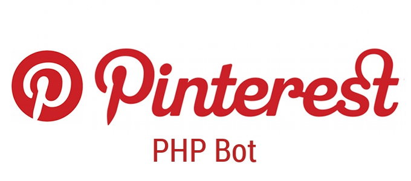

# Pinterest Bot for PHP

<p align="center">
    
</p>

##
<a href="https://travis-ci.org/seregazhuk/php-pinterest-bot"></a>
<a href="https://codeclimate.com/github/seregazhuk/php-pinterest-bot"></a>
<a href="https://scrutinizer-ci.com/g/seregazhuk/php-pinterest-bot/?branch=master"></a>
<a href="https://codeclimate.com/github/seregazhuk/php-pinterest-bot/coverage"></a>
<a href="https://styleci.io/repos/39557985"></a>
<a href="https://packagist.org/packages/seregazhuk/pinterest-bot"></a>
<a href="https://packagist.org/packages/seregazhuk/pinterest-bot"></a>

A PHP library to help you work with your Pinterest account without API credentials. 

The Pinterest API is painful: receiving an access token involves registering a developer account, 
registering an application, then waiting for confirmation. Not to mention, the
public API itself is poorly implemented and has a limited set of features. 

This library offers the full functionality available on Pinterest's website, with **no need to register an
application to receive an access token**. All that's needed is your account login information (but even this is not required
if you don't plan on creating pins, writing comments or sending messages)!

- [Installation](#installation)
- [Quick Start](#quick-start)
- [Examples](#examples)
- [Account](docs/account.md)
- [Boards](docs/boards.md)
- [Pins](docs/pins.md)
- [Pinners](docs/pinners.md)
- [Interests and topics](docs/interests-and-topics.md)
- [Search](docs/search.md)
- [Inbox](docs/inbox.md)
- [Keywords](docs/keywords.md)
- [Error handling](docs/errors-handling.md)
- [Use proxy](docs/proxy.md)
- [Custom request settings](docs/custom-request.md)
- [Cookies](docs/cookes.md)
- [Pagination](docs/pagination.md)


## Installation

### Dependencies
Library requires CURL extension and PHP 7.0 or above.

The recommended way to install this library is via [Composer](https://getcomposer.org). 
[New to Composer?](https://getcomposer.org/doc/00-intro.md)

```
composer require seregazhuk/pinterest-bot
```

## Quick Start

```php 
// You may need to amend this path to locate Composer's autoloader
require('vendor/autoload.php'); 

use seregazhuk\PinterestBot\Factories\PinterestBot;

$bot = PinterestBot::create();

// Login
$bot->auth->login('mypinterestlogin', 'mypinterestpassword');

// Get lists of your boards
$boards = $bot->boards->forUser('yourUserName');

// Create a pin
$bot->pins->create('http://exmaple.com/image.jpg', $boards[0]['id'], 'Pin description');
```

*Note*: Some methods (e.g. get user followers/following, pins
likes/dislikes, search and other feed queries) use Pinterest navigation through results (with bookmarks). This means that for every batch of results, a 
call is made to Pinterest and a [Pagination](#pagination) object with Pinterest API results is returned.

**To avoid being banned by Pinterest**, do not aggressively pin or write comments (e.g. creating hundreds of pins in a single minute).
Do this by inserting timeouts (`$bot->wait($seconds)`) with calls.

## Examples
These articles provide examples of common tasks that can be performed with the bot:

 - [Automate pinning](http://seregazhuk.github.io/2017/03/25/build-pinterest-bot-with-php-auto-pin/) ([source code](examples/auto_pins.php))
 - [Multiple Accounts and Proxy](http://seregazhuk.github.io/2017/03/28/build-printerest-bot-with-php-multiple-accounts/) ([source code](examples/multiple_accounts_and_proxy.php))
 - [Comments, Likes And Repins](http://seregazhuk.github.io/2017/03/30/build-pinterest-bot-with-php-comments-and-repins/) ([source code](examples/comments_likes_repins.php))
 - [Followers](http://seregazhuk.github.io/2017/04/01/build-pinterest-bit-with-php-followers/) ([source code](examples/followers.php))
 - [Parsing Pins](http://seregazhuk.github.io/2017/04/04/build-pinterest-bot-with-php-parsing-pins/) ([source code](examples/pins_parser.php))


## How can I thank you?
Why not star this GitHub repo? I'd love the attention!
Or, you can donate to my project on PayPal:

[](https://www.paypal.me/seregazhuk)

Thanks! 
